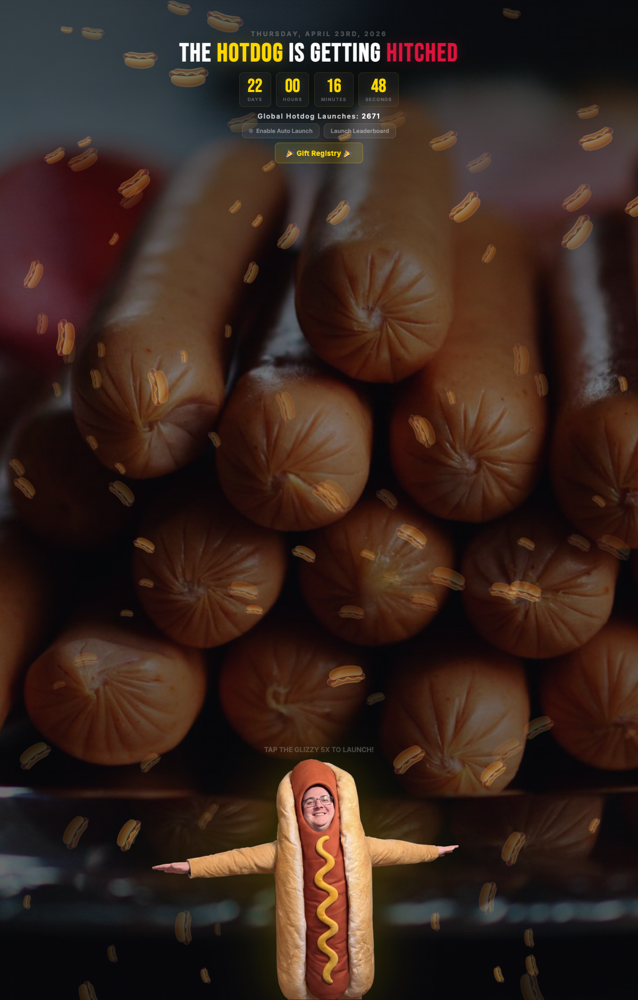

<p align="center">
  
  
  
  
  
</p>

<h1 align="center">Glizzy Timer</h1>
<p align="center"><strong>The Hotdog is Getting Hitched</strong></p>
<p align="center">
  <a href="https://glizzytimer.com">glizzytimer.com</a>
</p>

<p align="center">
  
</p>

---

## About

Wedding countdown for Brent, who wore a hotdog costume. Has a live countdown, an interactive hotdog rocket launcher with canvas particle effects, a global leaderboard on Cloudflare KV, and 120 floating hotdog emojis. Tap the hotdog man 5 times to launch him into space.

Started as a joke. Now has thousands of recorded launches.

## Features

- **Countdown**: Live timer to April 23rd, 2026
- **Rocket launcher**: Tap 5x to trigger a full launch sequence (nozzle, screen shake, canvas exhaust particles, emoji burst, congrats screen, return animation)
- **Particle engine**: `<canvas>` 2D particles at 60fps for rocket exhaust (velocity, gravity, opacity decay)
- **Global leaderboard**: Workers API + KV storage. Enter initials, scores sync automatically. Top 10 with medals.
- **Auto-launch mode**: Launches every 5.5s. Counts silently when tab is backgrounded, syncs every 10 launches.
- **Floating hotdogs**: 120 hotdog emojis drifting upward with randomized size/speed/opacity
- **Gift registry link**

## Architecture

```
Browser                          Cloudflare
  |                                  |
  |  tap tap tap tap TAP             |
  |  [canvas particles + shake]      |
  |                                  |
  |  POST /api/leaderboard --------> |  Workers Function
  |       { initials, launches }     |  reads/writes KV
  |  <-------- { scores, total }     |
  |                                  |
  |  GET /api/leaderboard ---------> |
  |  <-------- top 10 + total        |
```

## Tech Stack

| Layer | Technology |
|-------|-----------|
| Frontend | Vanilla HTML/CSS/JS, 1,127 lines |
| Fonts | Bebas Neue, Inter via Google Fonts |
| Particles | HTML5 Canvas 2D + requestAnimationFrame |
| API | Cloudflare Pages Functions |
| Storage | Cloudflare KV (`LEADERBOARD`) |
| Hosting | Cloudflare Pages |

## Project Structure

```
glizzytimer.com/
  index.html                 # Full site + canvas engine
  bg.jpg                     # Background photo
  hotdog-man.png             # Brent in costume (the rocket)
  functions/
    api/
      leaderboard.js         # GET/POST leaderboard
  wrangler.toml              # Cloudflare config + KV binding
```

## Deploy

```bash
wrangler pages deploy . --project-name=hotdog-wedding
```

Cloudflare project name is `hotdog-wedding` (original name). KV namespace ID: `b21a7eb58b3d40439295eac74a25ae36`.
